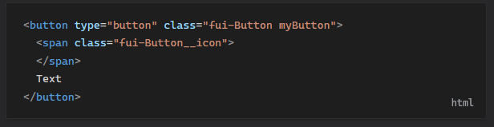

# expressive-code-plugin-data-lang

A third-party plugin for [Expressive Code](https://expressive-code.com/), an engine for presenting source code on the web.

It adds a `data-lang="<language>"` attribute onto the root HTML element of the code block (usually the [Frame](https://expressive-code.com/key-features/frames/) `<figure>` element).

This can be styled with [psuedo-elements](https://developer.mozilla.org/en-US/docs/Web/CSS/Pseudo-elements) to display the code block language to the website user.



## Example usage

```js
// astro.config.js
import { defineConfig } from "astro/config";
import expressiveCode from "astro-expressive-code";
import { pluginDataLang } from "expressive-code-plugin-data-lang";

export default defineConfig({
  integrations: [
    expressiveCode({
      plugins: [pluginDataLang()],
    }),
  ],
});
```

### Example CSS for showing the psuedo-element

```css
.expressive-code .frame::after {
  content: attr(data-lang);
  position: absolute;
  right: 1em;
  bottom: 1em;
  opacity: 0.7;
}
```
